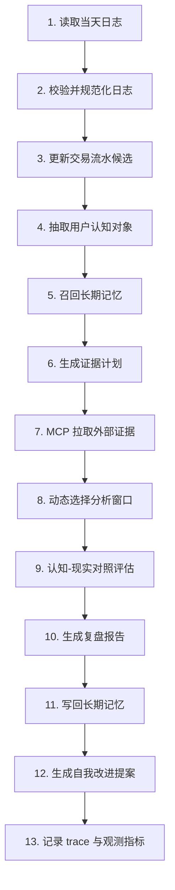

# 每日任务流转（实现级）

## 流程图


## 编排伪代码
```python
request = ReviewRunRequest(...)

normalized = intake.ingest(request)
ledger = ledger_engine.rebuild(normalized.trade_events, historical_events)
cognition = cognition_engine.extract(normalized)
memories = memory_service.recall(query_from(cognition, normalized))
context = context_builder.build(normalized, cognition, memories)
plan = evidence_planner.plan(cognition, memories, context.task_goals)
packet = mcp_gateway.collect(plan)
window = window_selector.select(plan, cognition, ledger, packet)
evaluation = evaluator.evaluate(cognition, packet, window, memories, ledger.position_snapshot)
report = report_generator.generate(evaluation, ledger.position_snapshot, ledger.pnl_snapshot, packet, window)
memory_write = memory_service.write(high_value_records(report, evaluation, cognition))
proposal = promptops.propose(report, evaluation, run_metrics)
trace = persist_trace(...)

return TaskResult(...)
```

## 失败恢复与幂等
- 使用 `run_id + user_id + run_date` 作为幂等键。
- 对 MCP 调用支持重试/超时/降级。
- `dry_run=true` 时禁用写回（记忆写入、报告持久化）。
- 单模块失败时可返回 `partial`，保留可诊断 trace。

## 并行建议
- 可并行：
  - 不同证据源 MCP 查询
  - 同一类证据多 provider 交叉验证
- 串行：
  - intake -> cognition -> planner
  - window_selector 在 evidence packet 后执行
  - evaluator 在 window decision 后执行
